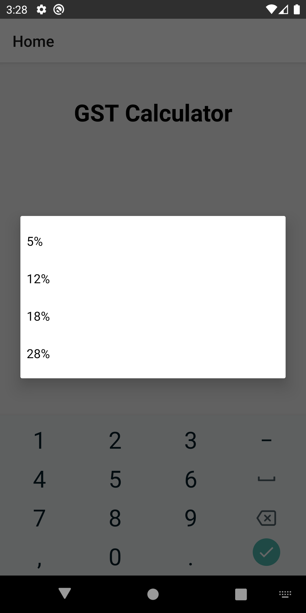

# GST Calculator using React Native
This is a react native application which takes the price and gst percentage is input and produces the GST value and the total price inclusive of GST.

## Steps to run the App
* Install react native and npm
* run npm start
* run react-native run-android to run in android

## Screenshots
### Input Page

### Result Page

### Drop down menu

### Invalid Input(Contains white space)

### Error for Invalid Entry

